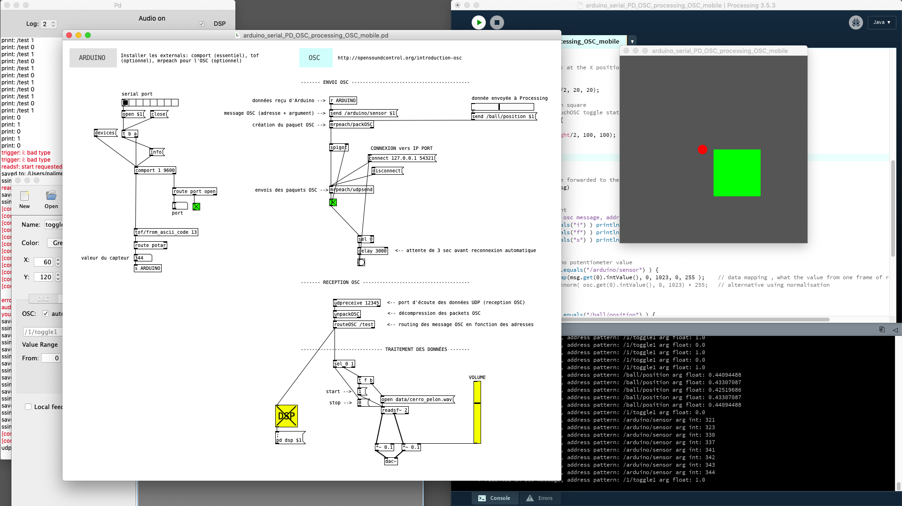

Arduino serial PD OSC processing OSC mobile
===========================================



Projet réalisé dans le cadre du cours "Techniques pour la création numérique : script" de la promo 2018/2020, à propos des protocoles de communications et leur utilisation.


```
                                                                          +------------+
                                                                          |  TOUCHOSC  |
                                                                          +------------+
                                                                                |
                                                                                –

                                                                             ( WiFi ) 

                                                                                –
                                                                                |
+-----------+                         +------------+                      +------------+
|  Arduino  |  <------ serie -------> |  PureData  | <------ OSC -------> | Processing |
+-----------+                         +------------+                      +------------+
```


Liste de matériel
-----------------

- 1 x arduino
- 1 x potentiomètre
- PureData
- Processing
- 1 x mobile + app [TouchOSC](https://hexler.net/products/touchosc)
