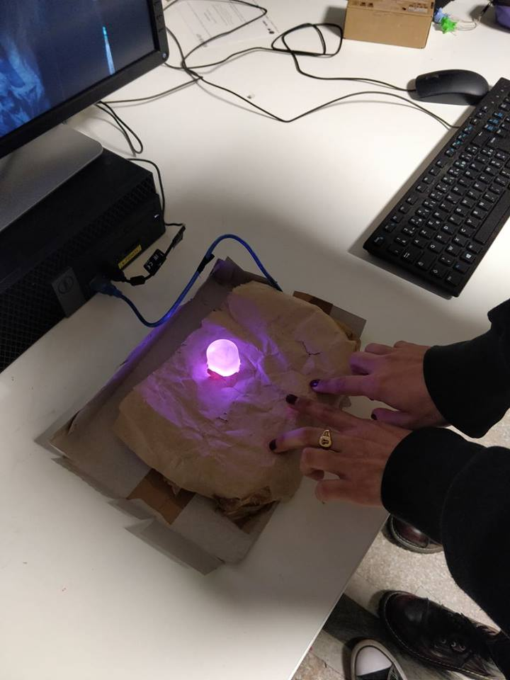
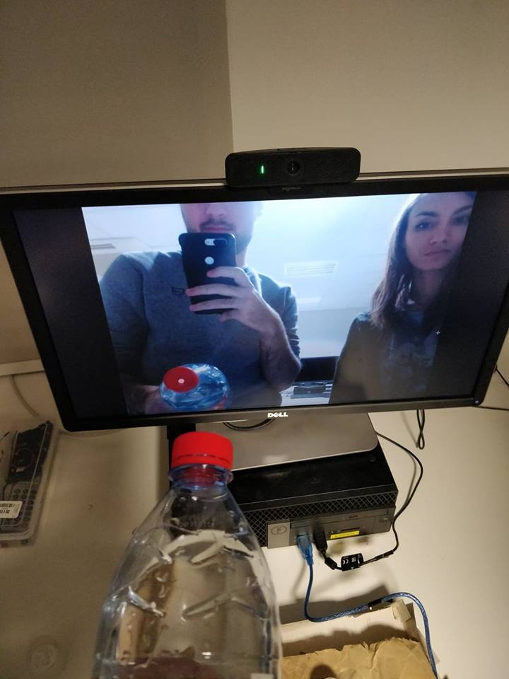

Projet 1 : Clavier RGB
----------------------
  

C'est un clavier créé avec des capteurs de pressions qui jouent des notes format MP3 et qui allument une LED RVB avec la possibilité de mélanger les couleurs entre elles.

Projet 2 : Webcam détection rouge
---------------------------------
  
Le projet est créé avec un écran et une webcam qui, à l'aide d'un repère numérique, capte la couleur rouge quand elle apparait à l'ecran.