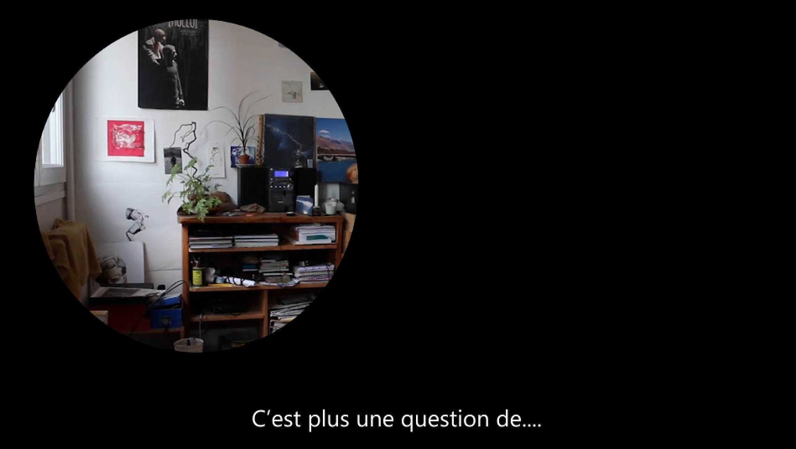

Entre Nous
==========

Installation interactive présentée au Patio du Bois de l'Aune, Aix-en-Provence, 2019.  
Projet réalisé par Johanna Johnson, promo 2017/2019.

    « J’ai toujours aimé capturer des vidéos de scènes de vie, d’espaces intimes et faire ressortir la poésie des instants simples. Ma perception influence ma façon de filmer, tout comme le regard du spectateur va affecter la pièce finale dans sa raison d’être. Je travaille sur les manières dont un artiste peut plonger dans un espace et comment un spectateur peut se plonger dans une image. Comment notre perception affecte l’image et en quoi ressortons-nous affectés par elle ? J’essaye d’approfondir ce jeu de va-et-vient entre l’image et le spectateur, en explorant l’espace qu’il y a entre ce que l’on voit et ce qu’il y a.

    J’ai mis en pratique ces questionnements à travers deux installations interactives vidéo dans lesquelles les spectateurs ont le contrôle sur ce qu’ils voient, sur ce qu’ils montrent et donc sur la façon de raconter une histoire. L’image en devient malléable. Au départ, ils voient un écran noir. Quand ils se rapprochent, leur présence fait apparaître un trou dévoilant une scène qu’ils ont la liberté d’observer à la guise de leurs déplacements. Ces pièces évoquent l’espace intime et questionne le rapport que chacun entretient avec son intimité et avec celle des autres. Les spectateurs sont ainsi amenés à contempler et raconter une intimité qui leur est extérieure. »

Liste de matériel:
- 1 x écran
- 1 x ordinateur
- 1 x webcam USB