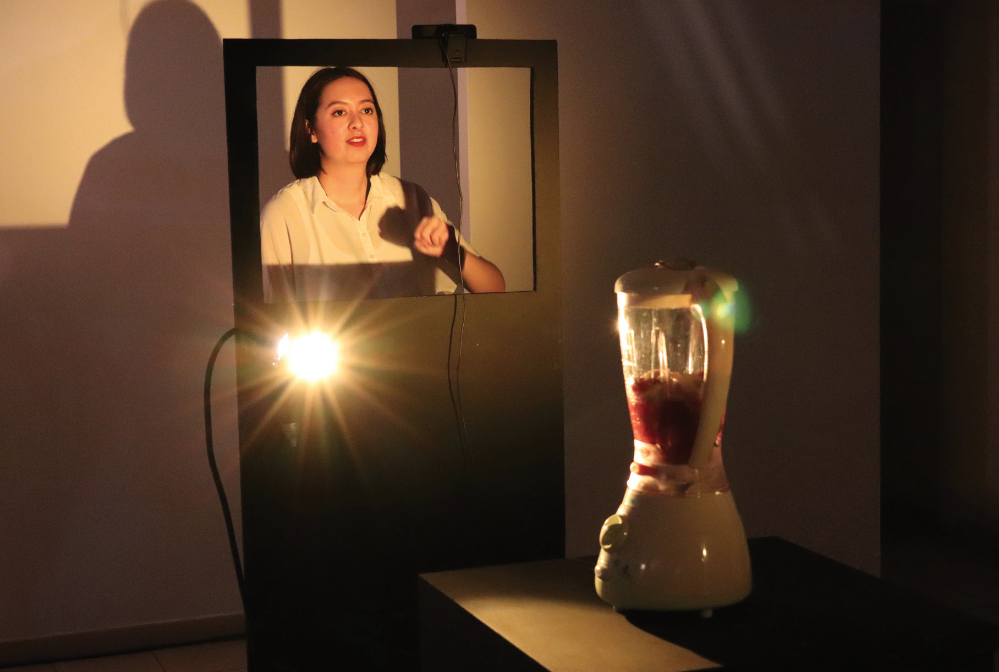

Jeu te vois
=============

Installation interactive présentée au Patio du Bois de l'Aune, Aix-en-Provence, 2019.  
Projet réalisé par Vatina Guillemin, promo 2017/2019.

    « Dans mon installation Jeu te vois, la dimension ludique s’allie à l’absurde quand une action banale, comme utiliser un blender ou des ventilateurs, devient complexe et amusante à réaliser. Pour activer ces objets du quotidien, deux personnes doivent coopérer dans une mission commune ou bien se confronter dans un duel de regards »

Liste de matériel:
- 1 x blender
- 1 x ordinateur
- 4 x webcam USB
- 4 x rallonge USB
- 1 x tutello