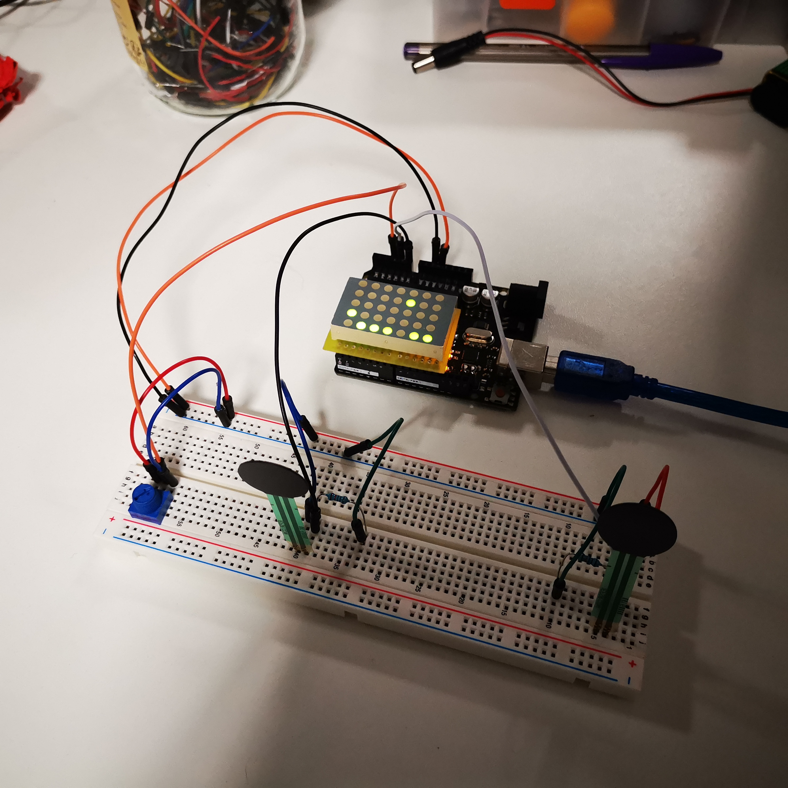

PONG
====
  

Deux petits jeux en un, un pong et quand on perd a shooter aérospatiale, tout ça sur une matrice LED.
Ce projet concrétise une découverte de l'arduino et du c++ donc le code est comme il est. Bon jeu !

Matériel
--------
- Arduino Uno
- Matrice led
- capteur de force
- potentiomètre