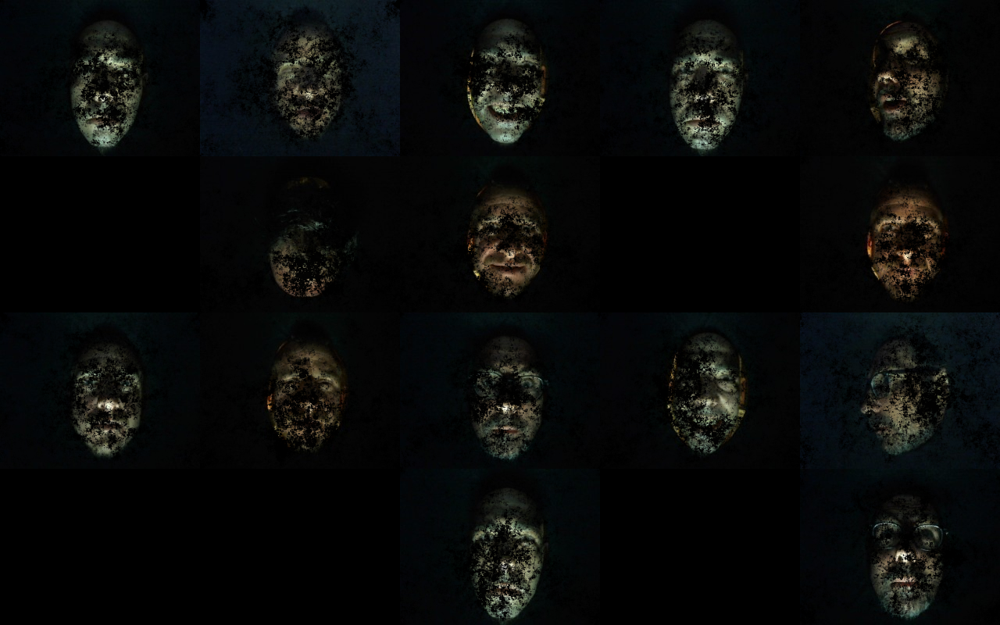

Sènescence
==========
  

Sènescence est une installation créée par les étudiants du Master professionnel "Création et Gestion de l'image Numérique" d'Aix-Marseille Université, s'inscrivant dans le cadre de la neuvième édition du festival Architectures Contemporaines.

Cette oeuvre interactive propose une expérience au cours de laquelle le spectateur est confronté à sa propre image et à sa transformation dans les algorithmes numériques.

[Vidéo de présentation](https://vimeo.com/164272445)